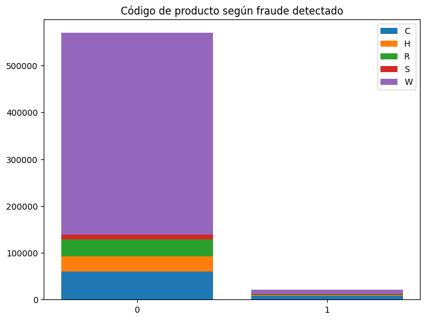
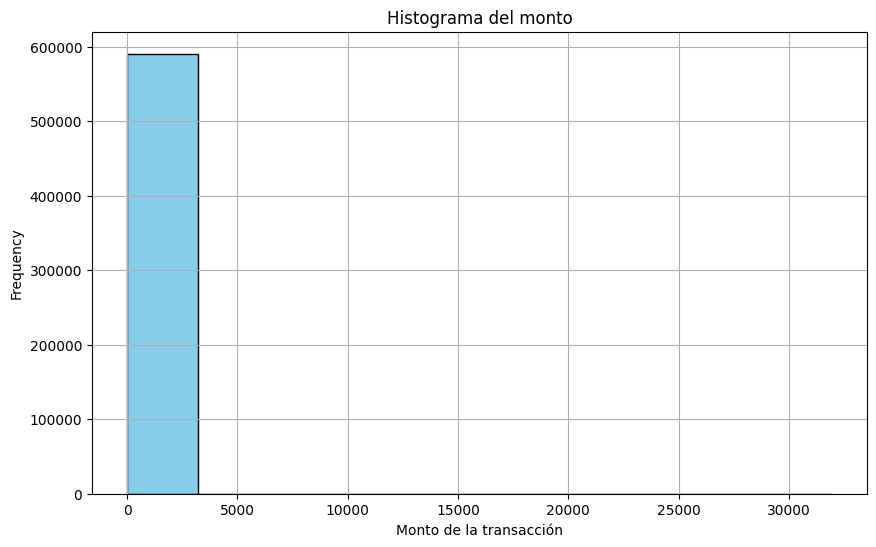
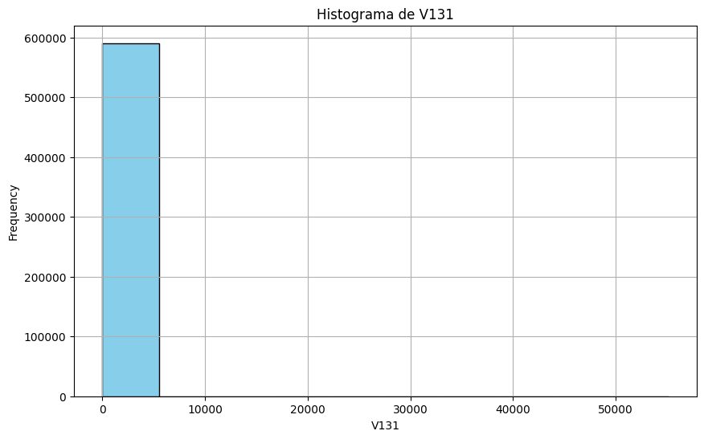

Importación de librerias y scripts.


```python
from pickle import load, dump
from pandas import DataFrame, concat
from cleaning import chisq_matrix

with open( 'DataRaw.pkl', 'rb' ) as f:
    DataRaw = load(f)
    DatRawCat = load(f)

with open( 'DataClean.pkl', 'rb' ) as f:
    DataClean = load(f)
    DataCat = load(f)
```


```python
DataRaw
```


<div>
<style scoped>
    .dataframe tbody tr th:only-of-type {
        vertical-align: middle;
    }

    .dataframe tbody tr th {
        vertical-align: top;
    }

    .dataframe thead th {
        text-align: right;
    }
</style>
<table border="1" class="dataframe">
  <thead>
    <tr style="text-align: right;">
      <th></th>
      <th>TransactionID</th>
      <th>isFraud</th>
      <th>TransactionDT</th>
      <th>TransactionAmt</th>
      <th>card1</th>
      <th>card2</th>
      <th>card3</th>
      <th>card5</th>
      <th>addr1</th>
      <th>addr2</th>
      <th>...</th>
      <th>id_17</th>
      <th>id_18</th>
      <th>id_19</th>
      <th>id_20</th>
      <th>id_21</th>
      <th>id_22</th>
      <th>id_24</th>
      <th>id_25</th>
      <th>id_26</th>
      <th>id_32</th>
    </tr>
  </thead>
  <tbody>
    <tr>
      <th>0</th>
      <td>2987000</td>
      <td>0</td>
      <td>86400</td>
      <td>68.50</td>
      <td>13926</td>
      <td>362.555488</td>
      <td>150.0</td>
      <td>142.0</td>
      <td>315.0</td>
      <td>87.0</td>
      <td>...</td>
      <td>189.451377</td>
      <td>14.237337</td>
      <td>353.128174</td>
      <td>403.882666</td>
      <td>368.26982</td>
      <td>16.002708</td>
      <td>12.800927</td>
      <td>329.608924</td>
      <td>149.070308</td>
      <td>26.508597</td>
    </tr>
    <tr>
      <th>1</th>
      <td>2987001</td>
      <td>0</td>
      <td>86401</td>
      <td>29.00</td>
      <td>2755</td>
      <td>404.000000</td>
      <td>150.0</td>
      <td>102.0</td>
      <td>325.0</td>
      <td>87.0</td>
      <td>...</td>
      <td>189.451377</td>
      <td>14.237337</td>
      <td>353.128174</td>
      <td>403.882666</td>
      <td>368.26982</td>
      <td>16.002708</td>
      <td>12.800927</td>
      <td>329.608924</td>
      <td>149.070308</td>
      <td>26.508597</td>
    </tr>
    <tr>
      <th>2</th>
      <td>2987002</td>
      <td>0</td>
      <td>86469</td>
      <td>59.00</td>
      <td>4663</td>
      <td>490.000000</td>
      <td>150.0</td>
      <td>166.0</td>
      <td>330.0</td>
      <td>87.0</td>
      <td>...</td>
      <td>189.451377</td>
      <td>14.237337</td>
      <td>353.128174</td>
      <td>403.882666</td>
      <td>368.26982</td>
      <td>16.002708</td>
      <td>12.800927</td>
      <td>329.608924</td>
      <td>149.070308</td>
      <td>26.508597</td>
    </tr>
    <tr>
      <th>3</th>
      <td>2987003</td>
      <td>0</td>
      <td>86499</td>
      <td>50.00</td>
      <td>18132</td>
      <td>567.000000</td>
      <td>150.0</td>
      <td>117.0</td>
      <td>476.0</td>
      <td>87.0</td>
      <td>...</td>
      <td>189.451377</td>
      <td>14.237337</td>
      <td>353.128174</td>
      <td>403.882666</td>
      <td>368.26982</td>
      <td>16.002708</td>
      <td>12.800927</td>
      <td>329.608924</td>
      <td>149.070308</td>
      <td>26.508597</td>
    </tr>
    <tr>
      <th>4</th>
      <td>2987004</td>
      <td>0</td>
      <td>86506</td>
      <td>50.00</td>
      <td>4497</td>
      <td>514.000000</td>
      <td>150.0</td>
      <td>102.0</td>
      <td>420.0</td>
      <td>87.0</td>
      <td>...</td>
      <td>166.000000</td>
      <td>14.237337</td>
      <td>542.000000</td>
      <td>144.000000</td>
      <td>368.26982</td>
      <td>16.002708</td>
      <td>12.800927</td>
      <td>329.608924</td>
      <td>149.070308</td>
      <td>32.000000</td>
    </tr>
    <tr>
      <th>...</th>
      <td>...</td>
      <td>...</td>
      <td>...</td>
      <td>...</td>
      <td>...</td>
      <td>...</td>
      <td>...</td>
      <td>...</td>
      <td>...</td>
      <td>...</td>
      <td>...</td>
      <td>...</td>
      <td>...</td>
      <td>...</td>
      <td>...</td>
      <td>...</td>
      <td>...</td>
      <td>...</td>
      <td>...</td>
      <td>...</td>
      <td>...</td>
    </tr>
    <tr>
      <th>590535</th>
      <td>3577535</td>
      <td>0</td>
      <td>15811047</td>
      <td>49.00</td>
      <td>6550</td>
      <td>362.555488</td>
      <td>150.0</td>
      <td>226.0</td>
      <td>272.0</td>
      <td>87.0</td>
      <td>...</td>
      <td>189.451377</td>
      <td>14.237337</td>
      <td>353.128174</td>
      <td>403.882666</td>
      <td>368.26982</td>
      <td>16.002708</td>
      <td>12.800927</td>
      <td>329.608924</td>
      <td>149.070308</td>
      <td>26.508597</td>
    </tr>
    <tr>
      <th>590536</th>
      <td>3577536</td>
      <td>0</td>
      <td>15811049</td>
      <td>39.50</td>
      <td>10444</td>
      <td>225.000000</td>
      <td>150.0</td>
      <td>224.0</td>
      <td>204.0</td>
      <td>87.0</td>
      <td>...</td>
      <td>189.451377</td>
      <td>14.237337</td>
      <td>353.128174</td>
      <td>403.882666</td>
      <td>368.26982</td>
      <td>16.002708</td>
      <td>12.800927</td>
      <td>329.608924</td>
      <td>149.070308</td>
      <td>26.508597</td>
    </tr>
    <tr>
      <th>590537</th>
      <td>3577537</td>
      <td>0</td>
      <td>15811079</td>
      <td>30.95</td>
      <td>12037</td>
      <td>595.000000</td>
      <td>150.0</td>
      <td>224.0</td>
      <td>231.0</td>
      <td>87.0</td>
      <td>...</td>
      <td>189.451377</td>
      <td>14.237337</td>
      <td>353.128174</td>
      <td>403.882666</td>
      <td>368.26982</td>
      <td>16.002708</td>
      <td>12.800927</td>
      <td>329.608924</td>
      <td>149.070308</td>
      <td>26.508597</td>
    </tr>
    <tr>
      <th>590538</th>
      <td>3577538</td>
      <td>0</td>
      <td>15811088</td>
      <td>117.00</td>
      <td>7826</td>
      <td>481.000000</td>
      <td>150.0</td>
      <td>224.0</td>
      <td>387.0</td>
      <td>87.0</td>
      <td>...</td>
      <td>189.451377</td>
      <td>14.237337</td>
      <td>353.128174</td>
      <td>403.882666</td>
      <td>368.26982</td>
      <td>16.002708</td>
      <td>12.800927</td>
      <td>329.608924</td>
      <td>149.070308</td>
      <td>26.508597</td>
    </tr>
    <tr>
      <th>590539</th>
      <td>3577539</td>
      <td>0</td>
      <td>15811131</td>
      <td>279.95</td>
      <td>15066</td>
      <td>170.000000</td>
      <td>150.0</td>
      <td>102.0</td>
      <td>299.0</td>
      <td>87.0</td>
      <td>...</td>
      <td>189.451377</td>
      <td>14.237337</td>
      <td>353.128174</td>
      <td>403.882666</td>
      <td>368.26982</td>
      <td>16.002708</td>
      <td>12.800927</td>
      <td>329.608924</td>
      <td>149.070308</td>
      <td>26.508597</td>
    </tr>
  </tbody>
</table>
<p>590540 rows × 403 columns</p>
</div>


```python
DataClean
```


<div>
<style scoped>
    .dataframe tbody tr th:only-of-type {
        vertical-align: middle;
    }

    .dataframe tbody tr th {
        vertical-align: top;
    }

    .dataframe thead th {
        text-align: right;
    }
</style>
<table border="1" class="dataframe">
  <thead>
    <tr style="text-align: right;">
      <th></th>
      <th>C1</th>
      <th>C3</th>
      <th>C5</th>
      <th>D1</th>
      <th>D3</th>
      <th>D10</th>
      <th>D11</th>
      <th>D12</th>
      <th>D13</th>
      <th>D14</th>
      <th>...</th>
      <th>V104</th>
      <th>V101</th>
      <th>V100</th>
      <th>V10</th>
      <th>TransactionAmt</th>
      <th>D9</th>
      <th>D8</th>
      <th>D7</th>
      <th>D5</th>
      <th>D4</th>
    </tr>
  </thead>
  <tbody>
    <tr>
      <th>0</th>
      <td>1.0</td>
      <td>0.0</td>
      <td>0.0</td>
      <td>14.0</td>
      <td>13.000000</td>
      <td>13.000000</td>
      <td>13.000000</td>
      <td>54.037533</td>
      <td>17.901295</td>
      <td>57.724444</td>
      <td>...</td>
      <td>0.0</td>
      <td>0.0</td>
      <td>0.0</td>
      <td>0.000000</td>
      <td>68.50</td>
      <td>0.561057</td>
      <td>146.058108</td>
      <td>41.63895</td>
      <td>42.335965</td>
      <td>140.002441</td>
    </tr>
    <tr>
      <th>1</th>
      <td>1.0</td>
      <td>0.0</td>
      <td>0.0</td>
      <td>0.0</td>
      <td>28.343348</td>
      <td>0.000000</td>
      <td>146.621465</td>
      <td>54.037533</td>
      <td>17.901295</td>
      <td>57.724444</td>
      <td>...</td>
      <td>0.0</td>
      <td>0.0</td>
      <td>0.0</td>
      <td>0.463915</td>
      <td>29.00</td>
      <td>0.561057</td>
      <td>146.058108</td>
      <td>41.63895</td>
      <td>42.335965</td>
      <td>0.000000</td>
    </tr>
    <tr>
      <th>2</th>
      <td>1.0</td>
      <td>0.0</td>
      <td>0.0</td>
      <td>0.0</td>
      <td>28.343348</td>
      <td>0.000000</td>
      <td>315.000000</td>
      <td>54.037533</td>
      <td>17.901295</td>
      <td>57.724444</td>
      <td>...</td>
      <td>0.0</td>
      <td>0.0</td>
      <td>0.0</td>
      <td>0.000000</td>
      <td>59.00</td>
      <td>0.561057</td>
      <td>146.058108</td>
      <td>41.63895</td>
      <td>42.335965</td>
      <td>0.000000</td>
    </tr>
    <tr>
      <th>3</th>
      <td>2.0</td>
      <td>0.0</td>
      <td>0.0</td>
      <td>112.0</td>
      <td>0.000000</td>
      <td>84.000000</td>
      <td>146.621465</td>
      <td>54.037533</td>
      <td>17.901295</td>
      <td>57.724444</td>
      <td>...</td>
      <td>0.0</td>
      <td>1.0</td>
      <td>4.0</td>
      <td>0.463915</td>
      <td>50.00</td>
      <td>0.561057</td>
      <td>146.058108</td>
      <td>41.63895</td>
      <td>0.000000</td>
      <td>94.000000</td>
    </tr>
    <tr>
      <th>4</th>
      <td>1.0</td>
      <td>0.0</td>
      <td>0.0</td>
      <td>0.0</td>
      <td>28.343348</td>
      <td>123.982137</td>
      <td>146.621465</td>
      <td>54.037533</td>
      <td>17.901295</td>
      <td>57.724444</td>
      <td>...</td>
      <td>0.0</td>
      <td>0.0</td>
      <td>0.0</td>
      <td>0.463915</td>
      <td>50.00</td>
      <td>0.561057</td>
      <td>146.058108</td>
      <td>41.63895</td>
      <td>42.335965</td>
      <td>140.002441</td>
    </tr>
    <tr>
      <th>...</th>
      <td>...</td>
      <td>...</td>
      <td>...</td>
      <td>...</td>
      <td>...</td>
      <td>...</td>
      <td>...</td>
      <td>...</td>
      <td>...</td>
      <td>...</td>
      <td>...</td>
      <td>...</td>
      <td>...</td>
      <td>...</td>
      <td>...</td>
      <td>...</td>
      <td>...</td>
      <td>...</td>
      <td>...</td>
      <td>...</td>
      <td>...</td>
    </tr>
    <tr>
      <th>590535</th>
      <td>2.0</td>
      <td>0.0</td>
      <td>1.0</td>
      <td>29.0</td>
      <td>30.000000</td>
      <td>56.000000</td>
      <td>56.000000</td>
      <td>54.037533</td>
      <td>17.901295</td>
      <td>57.724444</td>
      <td>...</td>
      <td>0.0</td>
      <td>0.0</td>
      <td>0.0</td>
      <td>0.000000</td>
      <td>49.00</td>
      <td>0.561057</td>
      <td>146.058108</td>
      <td>41.63895</td>
      <td>42.335965</td>
      <td>140.002441</td>
    </tr>
    <tr>
      <th>590536</th>
      <td>1.0</td>
      <td>0.0</td>
      <td>0.0</td>
      <td>0.0</td>
      <td>28.343348</td>
      <td>0.000000</td>
      <td>0.000000</td>
      <td>54.037533</td>
      <td>17.901295</td>
      <td>57.724444</td>
      <td>...</td>
      <td>0.0</td>
      <td>0.0</td>
      <td>0.0</td>
      <td>0.000000</td>
      <td>39.50</td>
      <td>0.561057</td>
      <td>146.058108</td>
      <td>41.63895</td>
      <td>42.335965</td>
      <td>0.000000</td>
    </tr>
    <tr>
      <th>590537</th>
      <td>1.0</td>
      <td>0.0</td>
      <td>1.0</td>
      <td>0.0</td>
      <td>28.343348</td>
      <td>0.000000</td>
      <td>0.000000</td>
      <td>54.037533</td>
      <td>17.901295</td>
      <td>57.724444</td>
      <td>...</td>
      <td>0.0</td>
      <td>0.0</td>
      <td>0.0</td>
      <td>1.000000</td>
      <td>30.95</td>
      <td>0.561057</td>
      <td>146.058108</td>
      <td>41.63895</td>
      <td>42.335965</td>
      <td>0.000000</td>
    </tr>
    <tr>
      <th>590538</th>
      <td>1.0</td>
      <td>0.0</td>
      <td>0.0</td>
      <td>22.0</td>
      <td>0.000000</td>
      <td>22.000000</td>
      <td>22.000000</td>
      <td>54.037533</td>
      <td>17.901295</td>
      <td>57.724444</td>
      <td>...</td>
      <td>0.0</td>
      <td>0.0</td>
      <td>1.0</td>
      <td>0.000000</td>
      <td>117.00</td>
      <td>0.561057</td>
      <td>146.058108</td>
      <td>41.63895</td>
      <td>0.000000</td>
      <td>22.000000</td>
    </tr>
    <tr>
      <th>590539</th>
      <td>2.0</td>
      <td>0.0</td>
      <td>1.0</td>
      <td>0.0</td>
      <td>0.000000</td>
      <td>1.000000</td>
      <td>0.000000</td>
      <td>54.037533</td>
      <td>17.901295</td>
      <td>57.724444</td>
      <td>...</td>
      <td>1.0</td>
      <td>0.0</td>
      <td>0.0</td>
      <td>1.000000</td>
      <td>279.95</td>
      <td>0.561057</td>
      <td>146.058108</td>
      <td>41.63895</td>
      <td>0.000000</td>
      <td>1.000000</td>
    </tr>
  </tbody>
</table>
<p>590540 rows × 28 columns</p>
</div>


```python
DataCat
```


<div>
<style scoped>
    .dataframe tbody tr th:only-of-type {
        vertical-align: middle;
    }

    .dataframe tbody tr th {
        vertical-align: top;
    }

    .dataframe thead th {
        text-align: right;
    }
</style>
<table border="1" class="dataframe">
  <thead>
    <tr style="text-align: right;">
      <th></th>
      <th>ProductCD</th>
      <th>card4</th>
      <th>card6</th>
      <th>P_emaildomain</th>
    </tr>
  </thead>
  <tbody>
    <tr>
      <th>0</th>
      <td>W</td>
      <td>discover</td>
      <td>credit</td>
      <td>gmail.com</td>
    </tr>
    <tr>
      <th>1</th>
      <td>W</td>
      <td>mastercard</td>
      <td>credit</td>
      <td>gmail.com</td>
    </tr>
    <tr>
      <th>2</th>
      <td>W</td>
      <td>visa</td>
      <td>debit</td>
      <td>outlook.com</td>
    </tr>
    <tr>
      <th>3</th>
      <td>W</td>
      <td>mastercard</td>
      <td>debit</td>
      <td>yahoo.com</td>
    </tr>
    <tr>
      <th>4</th>
      <td>H</td>
      <td>mastercard</td>
      <td>credit</td>
      <td>gmail.com</td>
    </tr>
    <tr>
      <th>...</th>
      <td>...</td>
      <td>...</td>
      <td>...</td>
      <td>...</td>
    </tr>
    <tr>
      <th>590535</th>
      <td>W</td>
      <td>visa</td>
      <td>debit</td>
      <td>gmail.com</td>
    </tr>
    <tr>
      <th>590536</th>
      <td>W</td>
      <td>mastercard</td>
      <td>debit</td>
      <td>gmail.com</td>
    </tr>
    <tr>
      <th>590537</th>
      <td>W</td>
      <td>mastercard</td>
      <td>debit</td>
      <td>gmail.com</td>
    </tr>
    <tr>
      <th>590538</th>
      <td>W</td>
      <td>mastercard</td>
      <td>debit</td>
      <td>aol.com</td>
    </tr>
    <tr>
      <th>590539</th>
      <td>W</td>
      <td>mastercard</td>
      <td>credit</td>
      <td>gmail.com</td>
    </tr>
  </tbody>
</table>
<p>590540 rows × 4 columns</p>
</div>


```python
y = DataRaw[ 'isFraud' ]
```

# Parte 1: Limpieza de los datos

En primer lugar cabe aclarar que los datos faltantes para cada variable se rellenaron con sus respectivas modas o medias según la naturaleza de la variable. En el caso de las categóricas, se omitieron aquellas variables cuyo porcentaje de datos faltantes superaba el 20%, ya que reemplazar estos datos faltantes por la moda podría llegar 

Para las variables continuas se usó el script provisto en el archivo `cleaning.py`, que consiste en dos fases de eliminación en base al mayor VIF en caso que este sea superior a 10 o 5. La primera fase ubica las dos variables independientes más correlacionadas entre sí y elimina aquella con mayor VIF en caso que supere el valor de 10. Este proceso para en el momento que la mayor correlación sea inferior a 0.5, despues de esto, se ejecuta la eliminación simple por VIF en el mayor de todos hasta que el mayor de los VIF sea inferior a 105. En últimas, esto garantiza una multicolinealidad extremadamente baja. 

Por otro lado, la eliminación en las variables categóricas se realizó mediante una prueba de contingencia de $\chi^2$, específicamente, se usó una matriz para visualizar el p-valor arrojado por la prueba entre las variables. Se pueden ver los resultados mencionados en la siguiente tabla:


```python
chisq_matrix( concat( [ DataFrame( y, columns=['isFraud'] ), DataCat ], axis=1 ) )
```


<div>
<style scoped>
    .dataframe tbody tr th:only-of-type {
        vertical-align: middle;
    }

    .dataframe tbody tr th {
        vertical-align: top;
    }

    .dataframe thead th {
        text-align: right;
    }
</style>
<table border="1" class="dataframe">
  <thead>
    <tr style="text-align: right;">
      <th></th>
      <th>isFraud</th>
      <th>ProductCD</th>
      <th>card4</th>
      <th>card6</th>
      <th>P_emaildomain</th>
    </tr>
  </thead>
  <tbody>
    <tr>
      <th>isFraud</th>
      <td>0.000000e+00</td>
      <td>0.0</td>
      <td>7.129275e-79</td>
      <td>0.0</td>
      <td>0.0</td>
    </tr>
    <tr>
      <th>ProductCD</th>
      <td>0.000000e+00</td>
      <td>0.0</td>
      <td>0.000000e+00</td>
      <td>0.0</td>
      <td>0.0</td>
    </tr>
    <tr>
      <th>card4</th>
      <td>7.129275e-79</td>
      <td>0.0</td>
      <td>0.000000e+00</td>
      <td>0.0</td>
      <td>0.0</td>
    </tr>
    <tr>
      <th>card6</th>
      <td>0.000000e+00</td>
      <td>0.0</td>
      <td>0.000000e+00</td>
      <td>0.0</td>
      <td>0.0</td>
    </tr>
    <tr>
      <th>P_emaildomain</th>
      <td>0.000000e+00</td>
      <td>0.0</td>
      <td>0.000000e+00</td>
      <td>0.0</td>
      <td>0.0</td>
    </tr>
  </tbody>
</table>
</div>


Es evidente que todas estas variables están fuertemente correlacionadas tanto entre sí mismas, como con la variable respuesta, por lo que es sufiente tomar una de estas para los modelos. En este caso se tomará la variable `ProductCD`, ya que no presentó datos faltantes (Esto se probará más adelante).

### Procentaje de datos faltantes

A continuación se pueden ver el porcentaje de los datos faltantes para las variables seleccionadas.


```python
from pandas import merge, read_csv, DataFrame
DataMissing = merge(read_csv('train_transaction.csv'), read_csv('train_identity.csv'), on='TransactionID', how='left')[[ 
    'isFraud', 'C1', 'C3', 'C5', 'D1', 'D3', 'D10', 'D11', 'D12', 'D13', 'D14', 'D15', 
    'ProductCD', "V142", "V141", "V138", "V135", "V131", "V130", "V12", "V104",
    "V101", "V100", "V10", "TransactionAmt", "D9", "D8", "D7", "D5", "D4" ]]

Miss = DataFrame((DataMissing.isnull().sum() / DataMissing.shape[0])*100, columns=['%'])
Miss[ Miss['%'] >= 20 ].T.style.set_caption('Porcentaje de datos faltantes mayor o igual al 20%')
```


<style type="text/css">
</style>
<table id="T_52484">
  <caption>Porcentaje de datos faltantes mayor o igual al 20%</caption>
  <thead>
    <tr>
      <th class="blank level0" >&nbsp;</th>
      <th id="T_52484_level0_col0" class="col_heading level0 col0" >D3</th>
      <th id="T_52484_level0_col1" class="col_heading level0 col1" >D11</th>
      <th id="T_52484_level0_col2" class="col_heading level0 col2" >D12</th>
      <th id="T_52484_level0_col3" class="col_heading level0 col3" >D13</th>
      <th id="T_52484_level0_col4" class="col_heading level0 col4" >D14</th>
      <th id="T_52484_level0_col5" class="col_heading level0 col5" >V142</th>
      <th id="T_52484_level0_col6" class="col_heading level0 col6" >V141</th>
      <th id="T_52484_level0_col7" class="col_heading level0 col7" >V138</th>
      <th id="T_52484_level0_col8" class="col_heading level0 col8" >V10</th>
      <th id="T_52484_level0_col9" class="col_heading level0 col9" >D9</th>
      <th id="T_52484_level0_col10" class="col_heading level0 col10" >D8</th>
      <th id="T_52484_level0_col11" class="col_heading level0 col11" >D7</th>
      <th id="T_52484_level0_col12" class="col_heading level0 col12" >D5</th>
      <th id="T_52484_level0_col13" class="col_heading level0 col13" >D4</th>
    </tr>
  </thead>
  <tbody>
    <tr>
      <th id="T_52484_level0_row0" class="row_heading level0 row0" >%</th>
      <td id="T_52484_row0_col0" class="data row0 col0" >44.514851</td>
      <td id="T_52484_row0_col1" class="data row0 col1" >47.293494</td>
      <td id="T_52484_row0_col2" class="data row0 col2" >89.041047</td>
      <td id="T_52484_row0_col3" class="data row0 col3" >89.509263</td>
      <td id="T_52484_row0_col4" class="data row0 col4" >89.469469</td>
      <td id="T_52484_row0_col5" class="data row0 col5" >86.123717</td>
      <td id="T_52484_row0_col6" class="data row0 col6" >86.123717</td>
      <td id="T_52484_row0_col7" class="data row0 col7" >86.123717</td>
      <td id="T_52484_row0_col8" class="data row0 col8" >47.293494</td>
      <td id="T_52484_row0_col9" class="data row0 col9" >87.312290</td>
      <td id="T_52484_row0_col10" class="data row0 col10" >87.312290</td>
      <td id="T_52484_row0_col11" class="data row0 col11" >93.409930</td>
      <td id="T_52484_row0_col12" class="data row0 col12" >52.467403</td>
      <td id="T_52484_row0_col13" class="data row0 col13" >28.604667</td>
    </tr>
  </tbody>
</table>


```python
Miss[ Miss['%'] < 20 ].T.style.set_caption('Porcentaje de datos faltantes menor al 20%')
```


<style type="text/css">
</style>
<table id="T_5788e">
  <caption>Porcentaje de datos faltantes menor al 20%</caption>
  <thead>
    <tr>
      <th class="blank level0" >&nbsp;</th>
      <th id="T_5788e_level0_col0" class="col_heading level0 col0" >isFraud</th>
      <th id="T_5788e_level0_col1" class="col_heading level0 col1" >C1</th>
      <th id="T_5788e_level0_col2" class="col_heading level0 col2" >C3</th>
      <th id="T_5788e_level0_col3" class="col_heading level0 col3" >C5</th>
      <th id="T_5788e_level0_col4" class="col_heading level0 col4" >D1</th>
      <th id="T_5788e_level0_col5" class="col_heading level0 col5" >D10</th>
      <th id="T_5788e_level0_col6" class="col_heading level0 col6" >D15</th>
      <th id="T_5788e_level0_col7" class="col_heading level0 col7" >ProductCD</th>
      <th id="T_5788e_level0_col8" class="col_heading level0 col8" >V135</th>
      <th id="T_5788e_level0_col9" class="col_heading level0 col9" >V131</th>
      <th id="T_5788e_level0_col10" class="col_heading level0 col10" >V130</th>
      <th id="T_5788e_level0_col11" class="col_heading level0 col11" >V12</th>
      <th id="T_5788e_level0_col12" class="col_heading level0 col12" >V104</th>
      <th id="T_5788e_level0_col13" class="col_heading level0 col13" >V101</th>
      <th id="T_5788e_level0_col14" class="col_heading level0 col14" >V100</th>
      <th id="T_5788e_level0_col15" class="col_heading level0 col15" >TransactionAmt</th>
    </tr>
  </thead>
  <tbody>
    <tr>
      <th id="T_5788e_level0_row0" class="row_heading level0 row0" >%</th>
      <td id="T_5788e_row0_col0" class="data row0 col0" >0.000000</td>
      <td id="T_5788e_row0_col1" class="data row0 col1" >0.000000</td>
      <td id="T_5788e_row0_col2" class="data row0 col2" >0.000000</td>
      <td id="T_5788e_row0_col3" class="data row0 col3" >0.000000</td>
      <td id="T_5788e_row0_col4" class="data row0 col4" >0.214888</td>
      <td id="T_5788e_row0_col5" class="data row0 col5" >12.873302</td>
      <td id="T_5788e_row0_col6" class="data row0 col6" >15.090087</td>
      <td id="T_5788e_row0_col7" class="data row0 col7" >0.000000</td>
      <td id="T_5788e_row0_col8" class="data row0 col8" >0.053172</td>
      <td id="T_5788e_row0_col9" class="data row0 col9" >0.053172</td>
      <td id="T_5788e_row0_col10" class="data row0 col10" >0.053172</td>
      <td id="T_5788e_row0_col11" class="data row0 col11" >12.881939</td>
      <td id="T_5788e_row0_col12" class="data row0 col12" >0.053172</td>
      <td id="T_5788e_row0_col13" class="data row0 col13" >0.053172</td>
      <td id="T_5788e_row0_col14" class="data row0 col14" >0.053172</td>
      <td id="T_5788e_row0_col15" class="data row0 col15" >0.000000</td>
    </tr>
  </tbody>
</table>


Como se puede ver en la tabla, gran parte de las variables elegidas al final, tienen un porcentaje de datos faltantes mayor al 20%. Para mantener el sentido del modelo, es mejor eliminar estas variables, ya que gran parte se reemplazará por la media, lo que puede llegar a generar datos irrelevantes para los modelos. Finalmente, los datos independientes quedan de la siguiente manera:


```python
from sklearn.preprocessing import OneHotEncoder
encoder = OneHotEncoder( sparse_output = False ).set_output( transform = 'pandas' )
transformed = encoder.fit_transform( DatRawCat[[ 'ProductCD' ]] )
encoded = DataFrame( transformed, columns = encoder.get_feature_names_out(['ProductCD']) )
X = concat( [ encoded, DataClean], axis = 1 )
X.drop( columns = ['D3', 'D11', 'D12', 'D13', 'D14', 'V142', 'V141', 'V138', 'V10', 'D9', 'D8', 'D7', 'D5', 'D4'], inplace=True )
X.head()
```


<div>
<style scoped>
    .dataframe tbody tr th:only-of-type {
        vertical-align: middle;
    }

    .dataframe tbody tr th {
        vertical-align: top;
    }

    .dataframe thead th {
        text-align: right;
    }
</style>
<table border="1" class="dataframe">
  <thead>
    <tr style="text-align: right;">
      <th></th>
      <th>ProductCD_C</th>
      <th>ProductCD_H</th>
      <th>ProductCD_R</th>
      <th>ProductCD_S</th>
      <th>ProductCD_W</th>
      <th>C1</th>
      <th>C3</th>
      <th>C5</th>
      <th>D1</th>
      <th>D10</th>
      <th>D15</th>
      <th>V135</th>
      <th>V131</th>
      <th>V130</th>
      <th>V12</th>
      <th>V104</th>
      <th>V101</th>
      <th>V100</th>
      <th>TransactionAmt</th>
    </tr>
  </thead>
  <tbody>
    <tr>
      <th>0</th>
      <td>0.0</td>
      <td>0.0</td>
      <td>0.0</td>
      <td>0.0</td>
      <td>1.0</td>
      <td>1.0</td>
      <td>0.0</td>
      <td>0.0</td>
      <td>14.0</td>
      <td>13.000000</td>
      <td>0.000000</td>
      <td>0.0</td>
      <td>0.0</td>
      <td>0.0</td>
      <td>1.000000</td>
      <td>0.0</td>
      <td>0.0</td>
      <td>0.0</td>
      <td>68.5</td>
    </tr>
    <tr>
      <th>1</th>
      <td>0.0</td>
      <td>0.0</td>
      <td>0.0</td>
      <td>0.0</td>
      <td>1.0</td>
      <td>1.0</td>
      <td>0.0</td>
      <td>0.0</td>
      <td>0.0</td>
      <td>0.000000</td>
      <td>0.000000</td>
      <td>0.0</td>
      <td>0.0</td>
      <td>0.0</td>
      <td>0.000000</td>
      <td>0.0</td>
      <td>0.0</td>
      <td>0.0</td>
      <td>29.0</td>
    </tr>
    <tr>
      <th>2</th>
      <td>0.0</td>
      <td>0.0</td>
      <td>0.0</td>
      <td>0.0</td>
      <td>1.0</td>
      <td>1.0</td>
      <td>0.0</td>
      <td>0.0</td>
      <td>0.0</td>
      <td>0.000000</td>
      <td>315.000000</td>
      <td>0.0</td>
      <td>0.0</td>
      <td>0.0</td>
      <td>1.000000</td>
      <td>0.0</td>
      <td>0.0</td>
      <td>0.0</td>
      <td>59.0</td>
    </tr>
    <tr>
      <th>3</th>
      <td>0.0</td>
      <td>0.0</td>
      <td>0.0</td>
      <td>0.0</td>
      <td>1.0</td>
      <td>2.0</td>
      <td>0.0</td>
      <td>0.0</td>
      <td>112.0</td>
      <td>84.000000</td>
      <td>111.000000</td>
      <td>0.0</td>
      <td>135.0</td>
      <td>354.0</td>
      <td>1.000000</td>
      <td>0.0</td>
      <td>1.0</td>
      <td>4.0</td>
      <td>50.0</td>
    </tr>
    <tr>
      <th>4</th>
      <td>0.0</td>
      <td>1.0</td>
      <td>0.0</td>
      <td>0.0</td>
      <td>0.0</td>
      <td>1.0</td>
      <td>0.0</td>
      <td>0.0</td>
      <td>0.0</td>
      <td>123.982137</td>
      <td>163.744579</td>
      <td>0.0</td>
      <td>0.0</td>
      <td>0.0</td>
      <td>0.559711</td>
      <td>0.0</td>
      <td>0.0</td>
      <td>0.0</td>
      <td>50.0</td>
    </tr>
  </tbody>
</table>
</div>


```python
with open( 'DataML.pkl', 'wb' ) as f:
    dump( y, f )
    dump( X, f )
```


```python
from pickle import load, dump

with open( 'DataML.pkl', 'rb' ) as f:
    y = load( f )
    X = load( f )
```

# Parte 2: Análisis exploratorio de los datos

### Variable dependiente


```python
import seaborn as sns
import pandas as pd
import matplotlib.pyplot as plt
import warnings

warnings.filterwarnings("ignore")

y_df = pd.DataFrame(y, columns=['isFraud'])

value_counts = y_df['isFraud'].value_counts()

value_counts_df = pd.DataFrame({'Value': value_counts.index, 'Count': value_counts.values})

plt.figure(figsize=(8, 6))
sns.barplot(x='Value', y='Count', data=value_counts_df, palette='Set2')
plt.title('Gráfico de barras de fraude')
plt.xlabel('Fraude')
plt.ylabel('Frecuencia')
plt.grid(True, axis='y')
plt.show()
```


    

    


Como se puede ver en la gráfica, la variable `isFraud` cuenta con un total de 569877 (97%) de transacciones lícitas, por lo que puede ser problemático para la generación de modelos sin una forma de balancear la desproporción. 

### `ProductCD`


```python
value_counts = DataCat['ProductCD'].value_counts()

value_counts_df = pd.DataFrame({'Value': value_counts.index, 'Count': value_counts.values})

plt.figure(figsize=(8, 6))
sns.barplot(x='Value', y='Count', data=value_counts_df, palette='Set2')
plt.title('Gráfico de barras de código de producto')
plt.xlabel('Fraude')
plt.ylabel('Frecuencia')
plt.grid(True, axis='y')
plt.show()
```


    

    


```python
from pandas import crosstab
from numpy import zeros, array, append

eda_df = concat( [ y_df, DataCat ], axis = 1 )

cross_table = crosstab( eda_df['isFraud'], eda_df['ProductCD'] )

ct = dict()
cross_dict = cross_table.to_dict()
for key in cross_dict:
    item = array([])
    for sub_key in cross_dict[ key ]: item = append( item, cross_dict[ key ][ sub_key ] )
    ct[ key ] = item

isFraud = ( '0', '1' )

fig, ax = plt.subplots(figsize=(8, 6))
bottom = zeros(2)

for boolean, count in ct.items():
    p = ax.bar(isFraud, count, label=boolean, bottom=bottom )
    bottom += count
ax.set_title("Código de producto según fraude detectado")
ax.legend(loc="upper right")

plt.show()
```


    

    


## Variables contínuas

Se puede observar el resumen de las variables en la siguiente tabla


```python
X.drop( columns = [ 'ProductCD_C', 'ProductCD_H', 'ProductCD_R', 'ProductCD_S', 'ProductCD_W' ] ).describe()
```


<div>
<style scoped>
    .dataframe tbody tr th:only-of-type {
        vertical-align: middle;
    }

    .dataframe tbody tr th {
        vertical-align: top;
    }

    .dataframe thead th {
        text-align: right;
    }
</style>
<table border="1" class="dataframe">
  <thead>
    <tr style="text-align: right;">
      <th></th>
      <th>C1</th>
      <th>C3</th>
      <th>C5</th>
      <th>D1</th>
      <th>D10</th>
      <th>D15</th>
      <th>V135</th>
      <th>V131</th>
      <th>V130</th>
      <th>V12</th>
      <th>V104</th>
      <th>V101</th>
      <th>V100</th>
      <th>TransactionAmt</th>
    </tr>
  </thead>
  <tbody>
    <tr>
      <th>count</th>
      <td>590540.000000</td>
      <td>590540.000000</td>
      <td>590540.000000</td>
      <td>590540.000000</td>
      <td>590540.000000</td>
      <td>590540.000000</td>
      <td>590540.000000</td>
      <td>590540.000000</td>
      <td>590540.000000</td>
      <td>590540.000000</td>
      <td>590540.000000</td>
      <td>590540.000000</td>
      <td>590540.000000</td>
      <td>590540.000000</td>
    </tr>
    <tr>
      <th>mean</th>
      <td>14.092458</td>
      <td>0.005644</td>
      <td>5.571526</td>
      <td>94.347568</td>
      <td>123.982137</td>
      <td>163.744579</td>
      <td>17.250132</td>
      <td>31.133302</td>
      <td>92.165849</td>
      <td>0.559711</td>
      <td>0.085433</td>
      <td>0.889249</td>
      <td>0.273504</td>
      <td>135.027176</td>
    </tr>
    <tr>
      <th>std</th>
      <td>133.569018</td>
      <td>0.150536</td>
      <td>25.786976</td>
      <td>157.490898</td>
      <td>170.456102</td>
      <td>186.805646</td>
      <td>293.769431</td>
      <td>161.118406</td>
      <td>315.876473</td>
      <td>0.476516</td>
      <td>0.648545</td>
      <td>20.577098</td>
      <td>0.946924</td>
      <td>239.162522</td>
    </tr>
    <tr>
      <th>min</th>
      <td>0.000000</td>
      <td>0.000000</td>
      <td>0.000000</td>
      <td>0.000000</td>
      <td>0.000000</td>
      <td>-83.000000</td>
      <td>0.000000</td>
      <td>0.000000</td>
      <td>0.000000</td>
      <td>0.000000</td>
      <td>0.000000</td>
      <td>0.000000</td>
      <td>0.000000</td>
      <td>0.251000</td>
    </tr>
    <tr>
      <th>25%</th>
      <td>1.000000</td>
      <td>0.000000</td>
      <td>0.000000</td>
      <td>0.000000</td>
      <td>0.000000</td>
      <td>0.000000</td>
      <td>0.000000</td>
      <td>0.000000</td>
      <td>0.000000</td>
      <td>0.000000</td>
      <td>0.000000</td>
      <td>0.000000</td>
      <td>0.000000</td>
      <td>43.321000</td>
    </tr>
    <tr>
      <th>50%</th>
      <td>1.000000</td>
      <td>0.000000</td>
      <td>0.000000</td>
      <td>3.000000</td>
      <td>43.000000</td>
      <td>117.000000</td>
      <td>0.000000</td>
      <td>0.000000</td>
      <td>0.000000</td>
      <td>0.559711</td>
      <td>0.000000</td>
      <td>0.000000</td>
      <td>0.000000</td>
      <td>68.769000</td>
    </tr>
    <tr>
      <th>75%</th>
      <td>3.000000</td>
      <td>0.000000</td>
      <td>1.000000</td>
      <td>121.000000</td>
      <td>150.000000</td>
      <td>251.000000</td>
      <td>0.000000</td>
      <td>0.000000</td>
      <td>59.000000</td>
      <td>1.000000</td>
      <td>0.000000</td>
      <td>0.000000</td>
      <td>0.000000</td>
      <td>125.000000</td>
    </tr>
    <tr>
      <th>max</th>
      <td>4685.000000</td>
      <td>26.000000</td>
      <td>349.000000</td>
      <td>640.000000</td>
      <td>876.000000</td>
      <td>879.000000</td>
      <td>90750.000000</td>
      <td>55125.000000</td>
      <td>55125.000000</td>
      <td>3.000000</td>
      <td>15.000000</td>
      <td>869.000000</td>
      <td>28.000000</td>
      <td>31937.391000</td>
    </tr>
  </tbody>
</table>
</div>


Es evidente que para la mayoria de variables, la desviación estándar es mucho más alta que la media, por lo que los datos van a estar extremadamente dispersos. Más aún, Todos los máximos son extremadamente altos, mucho más que el tercer cuartil, por tanto se evidencian datos extremadamente atípicos. También es notable la diferencia entre la media y la mediana, lo que implica que todas las variables tienen una severa asimetría.

### `TransactionAmt`


```python
transaction_amt_values = X['TransactionAmt']

plt.figure(figsize=(10, 6))
plt.hist(transaction_amt_values, bins=10, color='skyblue', edgecolor='black')
plt.title('Histograma del monto')
plt.xlabel('Monto de la transacción')
plt.ylabel('Frequency')
plt.grid(True)
plt.show()
```


    

    


Es notable que casi el total de los datos se encuentra en el primer intérvalo inferior a 5000, además el tamaño del intérvalo implica la existencia de uno o más datos atípicos extremadamente altos.


```python
eda_df = concat( [eda_df, X], axis = 1 )
```


```python
eda_df['isFraud'] = eda_df['isFraud'].astype(str)

plt.figure(figsize=(10, 6))
sns.boxplot(x='TransactionAmt', y='isFraud', data=eda_df, palette='Set2' )
plt.title('Cantidad del monto según fraude detectado')
plt.xlabel('Monto')
plt.ylabel('Fraude')
plt.grid(True)
plt.show()
```


    

    


Como se mencionó previamente, se encuentra un dato extremádamente atípico. Podemos ver que hay una tendencia para las transacciones lícitas en alcanzar valores más altos, aún así, no se pueden sacar muchas conclusiones dada la desproporción de los datos.

### `C1`


```python
values = X['C1']

plt.figure(figsize=(10, 6))
plt.hist(values, bins=10, color='skyblue', edgecolor='black')
plt.title('Histograma de C1')
plt.xlabel('C1')
plt.ylabel('Frequency')
plt.grid(True)
plt.show()
```


    

    


Así como en la variable anterior, se encuentra una asimetría extrema. Esto se debe especialmente al hecho que el 75% de los datos es menor o igual a 3, mientras que hay un rango extremadamente amplio.


```python
plt.figure(figsize=(10, 6))
sns.boxplot(x='C1', y='isFraud', data=eda_df, palette='Set2' )
plt.title('C1 según fraude detectado')
plt.xlabel('C1')
plt.ylabel('Fraude')
plt.grid(True)
plt.show()
```


    

    


En este caso tambien es evidente que hay mayor concentración de datos atípicos en el conjunto lícito dada la disparidad, pero se puede ver claramente que ambas mantienen cierta similitud. Como se pudo ver en la tabla descriptiva, la gran mayoria de las variables se concentran en el intérvalo de 0-3.

### `C3`


```python
values = X['C3']

plt.figure(figsize=(10, 6))
plt.hist(values, bins=10, color='skyblue', edgecolor='black')
plt.title('Histograma de C3')
plt.xlabel('C3')
plt.ylabel('Frequency')
plt.grid(True)
plt.show()
```


    

    


Es notorio que no se puede apreciar ningún valor por fuera del intérvalo marcado, por lo que como el resto de variables, es evidencia de muchos datos atípicos.


```python
plt.figure(figsize=(10, 6))
sns.boxplot(x='C3', y='isFraud', data=eda_df, palette='Set2' )
plt.title('C3 según fraude detectado')
plt.xlabel('C3')
plt.ylabel('Fraude')
plt.grid(True)
plt.show()
```


    

    


Como se menciona antes, la mayoria de datos se concentra en el valor de 0, aún así, se presentan unos cuantos datos atípicos en la parte lícita de las transacciones.

### `C5`


```python
values = X['C5']

plt.figure(figsize=(10, 6))
plt.hist(values, bins=10, color='skyblue', edgecolor='black')
plt.title('Histograma de C5')
plt.xlabel('C5')
plt.ylabel('Frequency')
plt.grid(True)
plt.show()
```


    

    


A diferencia de las variables anteriores, esta sí permite observar unos cuantos valores por fuera de los valores iniciales, aún así, mantiene el patrón previo de una concentración de datos extrema al inicio del intérvalo.


```python
plt.figure(figsize=(10, 6))
sns.boxplot(x='C5', y='isFraud', data=eda_df, palette='Set2' )
plt.title('C5 según fraude detectado')
plt.xlabel('C5')
plt.ylabel('Fraude')
plt.grid(True)
plt.show()
```


    

    


Por otro lado, podemos observar una ligera diferencia más marcada entre los casos de fraude, ya que las transacciones lícitas tienen en general datos atípicos mayores que los de las transacciones marcadas como fraude.

### `D1`


```python
values = X['D1']

plt.figure(figsize=(10, 6))
plt.hist(values, bins=10, color='skyblue', edgecolor='black')
plt.title('Histograma de D1')
plt.xlabel('D1')
plt.ylabel('Frequency')
plt.grid(True)
plt.show()
```


    

    


De forma similar a la variable anterior, a pesar de tener datos atípicos, es evidente que la variable posee una distribución más cercana al origen.


```python
plt.figure(figsize=(10, 6))
sns.boxplot(x='D1', y='isFraud', data=eda_df, palette='Set2' )
plt.title('D1 según fraude detectado')
plt.xlabel('D1')
plt.ylabel('Fraude')
plt.grid(True)
plt.show()
```


    

    


Es evidente que las transacciones lícitas tienen tendencia a poseer un valor mayor de la variable D1.

### `D10`


```python
values = X['D10']

plt.figure(figsize=(10, 6))
plt.hist(values, bins=10, color='skyblue', edgecolor='black')
plt.title('D10')
plt.xlabel('D10')
plt.ylabel('Frequency')
plt.grid(True)
plt.show()
```


    

    


Esta variable presenta una distribución aún menos dispersa que la anterior, por lo que se puede esperar una mejor representación de la variable respuesta.


```python
plt.figure(figsize=(10, 6))
sns.boxplot(x='D10', y='isFraud', data=eda_df, palette='Set2' )
plt.title('D10 según fraude detectado')
plt.xlabel('D10')
plt.ylabel('Fraude')
plt.grid(True)
plt.show()
```


    

    


Es evidente que la mediana de las transacciones lícitas es mayor a aquella de las ilícitas, mientras que los datos atípicos se extienden a un mayor rango.

### `D15`


```python
values = X['D15']

plt.figure(figsize=(10, 6))
plt.hist(values, bins=10, color='skyblue', edgecolor='black')
plt.title('Histograma de D15')
plt.xlabel('D15')
plt.ylabel('Frequency')
plt.grid(True)
plt.show()
```


    

    


Esta variable comparte comportamiento con la variable anterior, presentando aún menos dispersión de los datos.


```python
plt.figure(figsize=(10, 6))
sns.boxplot(x='D15', y='isFraud', data=eda_df, palette='Set2' )
plt.title('D15 según fraude detectado')
plt.xlabel('D15')
plt.ylabel('Fraude')
plt.grid(True)
plt.show()
```


    

    


De la misma forma, hay una diferencia marcada en la mediana para ambas categorías.

### `V100`


```python
values = X['V100']

plt.figure(figsize=(10, 6))
plt.hist(values, bins=10, color='skyblue', edgecolor='black')
plt.title('Histograma de V100')
plt.xlabel('V100')
plt.ylabel('Frequency')
plt.grid(True)
plt.show()
```


    

    


Por otro lado, esta variable presenta un comportamiento similar a las primeras variables, donde se espera una gran cantidad de datos atípicos.


```python
plt.figure(figsize=(10, 6))
sns.boxplot(x='V100', y='isFraud', data=eda_df, palette='Set2' )
plt.title('V100 según fraude detectado')
plt.xlabel('V100')
plt.ylabel('Fraude')
plt.grid(True)
plt.show()
```


    

    


Aún así, esta variable presenta una ligera diferencia para la variable categórica, dado que los datos atípicos ( o mayores a 0 ), se extienden más para las transacciones lícitas

### `V131`


```python
values = X['V131']

plt.figure(figsize=(10, 6))
plt.hist(values, bins=10, color='skyblue', edgecolor='black')
plt.title('Histograma de V131')
plt.xlabel('V131')
plt.ylabel('Frequency')
plt.grid(True)
plt.show()
```


    

    


Esta variable presenta el mismo comportamiento a la primera variable, donde no son evidentes valores por fuera de un intervalo, lo que implica que hay valores atípicos extremadamente grandes.


```python
plt.figure(figsize=(10, 6))
sns.boxplot(x='V131', y='isFraud', data=eda_df, palette='Set2' )
plt.title('V131 según fraude detectado')
plt.xlabel('V131')
plt.ylabel('Fraude')
plt.grid(True)
plt.show()
```


    

    


Como se menciona antes, la mayoría de datos se concentran en el valor 0, teniendo unos cuantos datos atípicos más grandes en las transacciones lícitas.

# Parte 3: Modelos de clasificación

En primer lugar, para evitar fuga de información, se separará un conjunto de prueba, dado el uso de ADASYN


```python
from sklearn.model_selection import train_test_split

y = y.astype(int)

X_train, X_test, y_train, y_test = train_test_split( X, y, test_size = 0.2, random_state = 37 )

y_df = pd.DataFrame(y_test, columns=['isFraud'])

value_counts = y_df['isFraud'].value_counts()

value_counts_df = pd.DataFrame({'Value': value_counts.index, 'Count': value_counts.values})

plt.figure(figsize=(8, 6))
sns.barplot(x='Value', y='Count', data=value_counts_df, palette='Set2')
plt.title('Gráfico de barras de fraude muestreado')
plt.xlabel('Fraude')
plt.ylabel('Frecuencia')
plt.grid(True, axis='y')
plt.show()
```


    

    


Como se puede ver, el conjunto de testeo mantiene la proporción antes mencionada de 97-3. Ahora bien, se realizarán los modelos con y sin rebalanceamiento ADASYN. Podemos visualizar la nueva variable dependiente balanceada con la siguiente gráfica:


```python
from imblearn.over_sampling import ADASYN

adasyn = ADASYN( random_state = 37 )

X_bal, y_bal = adasyn.fit_resample( X_train, y_train )
```


```python
y_df = pd.DataFrame(y_bal, columns=['isFraud'])

value_counts = y_df['isFraud'].value_counts()

value_counts_df = pd.DataFrame({'Value': value_counts.index, 'Count': value_counts.values})

plt.figure(figsize=(8, 6))
sns.barplot(x='Value', y='Count', data=value_counts_df, palette='Set2')
plt.title('Gráfico de barras de fraude rebalanceado')
plt.xlabel('Fraude')
plt.ylabel('Frecuencia')
plt.grid(True, axis='y')
plt.show()
```


    

    


```python
with open( 'DataModels.pkl', 'wb' ) as f:
    dump( ( X_train, X_bal, X_test ), f )
    dump( ( y_train, y_bal, y_test ), f )
```


```python
with open( 'DataModels.pkl', 'rb' ) as f:
    X_train, X_bal, X_test = load( f )
    y_train, y_bal, y_test = load( f )
```


```python
from pickle import load, dump
```


```python
from sklearn.metrics import precision_score, recall_score, f1_score, roc_auc_score, roc_curve, confusion_matrix
import matplotlib.pyplot as plt
import seaborn as sns
from numpy import newaxis

def evaluate_model(model, X_test, y_test):
    y_proba = model.predict_proba(X_test)[:, 1]
    
    y_pred = model.predict(X_test)

    if not set(y_pred).issubset({0, 1}):
        raise ValueError("Predictions contain values other than 0 and 1")
    
    precision = precision_score(y_test, y_pred)
    recall = recall_score(y_test, y_pred)
    f1 = f1_score(y_test, y_pred)
    auc = roc_auc_score(y_test, y_proba)
    
    return {
        'Precision': precision,
        'Recall': recall,
        'F1': f1,
        'AUC': auc
    }


def plot_roc_curve(model, X_test, y_test):
    y_proba = model.predict_proba(X_test)[:, 1]
    
    fpr, tpr, _ = roc_curve(y_test, y_proba)
    
    plt.figure(figsize=(10, 6))
    plt.plot(fpr, tpr, label=f'Curva ROC(area = {roc_auc_score(y_test, y_proba)})' )
    plt.plot([0, 1], [0, 1], 'k--')
    plt.xlim([0.0, 1.0])
    plt.ylim([0.0, 1.05])
    plt.xlabel('Porcentaje de Falsos Positivos')
    plt.ylabel('Porcentaje de Verdaderos Positivos')
    plt.title('Curva ROC')
    plt.legend(loc="lower right")
    plt.show()

def plot_confusion_matrix(model, X_test, y_test):
    y_pred = model.predict(X_test)
    
    cm = confusion_matrix(y_test, y_pred)
    
    cm_norm = cm.astype('float') / cm.sum(axis=1)[:, newaxis] * 100
    
    plt.figure(figsize=(8, 6))
    sns.heatmap(cm_norm, annot=True, cmap="Blues", fmt=".2f", cbar=False, annot_kws={"size": 14})
    plt.xlabel('Predicho')
    plt.ylabel('Verdadero')
    plt.title('Matriz de confusión')
    plt.show()
```


```python
indexes = []
results = []
```

### Clasificación Bayesiana


```python
from pandas import DataFrame
with open( 'Models/NaiveBayesModel.pkl', 'rb' ) as f:
    NBayes_model_base = load( f )
    NBayes_model_ada = load( f )
```

#### Base

Los resultados del modelo en el set de prueba son los siguientes:


```python
result = evaluate_model( NBayes_model_base, X_test, y_test )
indexes.append( 'Naive Bayes Base' )
results.append( result )
DataFrame( [result], index = ['Naive Bayes'] )
```


<div>
<style scoped>
    .dataframe tbody tr th:only-of-type {
        vertical-align: middle;
    }

    .dataframe tbody tr th {
        vertical-align: top;
    }

    .dataframe thead th {
        text-align: right;
    }
</style>
<table border="1" class="dataframe">
  <thead>
    <tr style="text-align: right;">
      <th></th>
      <th>Precision</th>
      <th>Recall</th>
      <th>F1</th>
      <th>AUC</th>
    </tr>
  </thead>
  <tbody>
    <tr>
      <th>Naive Bayes</th>
      <td>0.482731</td>
      <td>0.1463</td>
      <td>0.224547</td>
      <td>0.751902</td>
    </tr>
  </tbody>
</table>
</div>


Los puntajes del modelo son muy bajos, lo que implica que el modelo no va a ser un buen clasificador para la variable respuesta. Lo único rescatable puede ser su puntaje de AUC, pero como se verá en próximos modelos, es uno de los más bajos.


```python
plot_roc_curve( NBayes_model_base, X_test, y_test )
```


    

    


La curva ROC nos muestra que la clasificación es pasable para detectar la categoría de la variable respuesta, aún así, se encuentra muy lejos de ser un buen modelo.


```python
plot_confusion_matrix( NBayes_model_base, X_test, y_test )
```


    

    


En esta gráfica se puede evidenciar lo que será el problema para muchos modelos en este trabajo: tiene una mayor tendencia a predecir una etiqueta como negativa, ya que el desbalance genera una tendencia para los modelos de sobreajustarse a la categoría mayoritaria.

#### AdaSyn

Los resultados del modelo se ven a continuación:


```python
result = evaluate_model( NBayes_model_ada, X_test, y_test )
indexes.append( 'Naive Bayes AdaSyn' )
results.append( result )
DataFrame( [result], index = ['Naive Bayes'] )
```


<div>
<style scoped>
    .dataframe tbody tr th:only-of-type {
        vertical-align: middle;
    }

    .dataframe tbody tr th {
        vertical-align: top;
    }

    .dataframe thead th {
        text-align: right;
    }
</style>
<table border="1" class="dataframe">
  <thead>
    <tr style="text-align: right;">
      <th></th>
      <th>Precision</th>
      <th>Recall</th>
      <th>F1</th>
      <th>AUC</th>
    </tr>
  </thead>
  <tbody>
    <tr>
      <th>Naive Bayes</th>
      <td>0.078335</td>
      <td>0.701315</td>
      <td>0.140928</td>
      <td>0.752869</td>
    </tr>
  </tbody>
</table>
</div>


Es evidente la diferencia abismal entre los dos modelos, ya que sus precision y recall estan casi intercambiados, esto sin mejorar su AUC.


```python
plot_roc_curve( NBayes_model_ada, X_test, y_test )
```


    

    


Su curva ROC presenta un comportamiento similar al base, como se evidencia en su similitud de valores AUC.


```python
plot_confusion_matrix( NBayes_model_ada, X_test, y_test )
```


    

    


Ahora biem, esta gráfica permite entender la importancia del rebalanceamiento de los datos, ya que permitió homogeneizar el porcentaje de tanto verdaderos positivos como de verdaderos negativos. Cabe aclarar que las deficiencias en los scores se deben al hecho que la variable de prueba no está rebalanceada, por lo que los negativos que no llega a predecir suman más al error que aquellas positivas que no predice.

### Árboles de decisión

El modelo resultante queda de la siguiente forma


```python
with open( 'Models/DecisionTreeModel.pkl', 'rb' ) as f:
    DTree_model_base = load( f )
    DTree_model_ada = load( f )
```

#### Base

Los parámetros del árbol son los siguientes


```python
DataFrame( [DTree_model_base.best_params_], index = ['Decision Tree base'] )
```


<div>
<style scoped>
    .dataframe tbody tr th:only-of-type {
        vertical-align: middle;
    }

    .dataframe tbody tr th {
        vertical-align: top;
    }

    .dataframe thead th {
        text-align: right;
    }
</style>
<table border="1" class="dataframe">
  <thead>
    <tr style="text-align: right;">
      <th></th>
      <th>max_depth</th>
    </tr>
  </thead>
  <tbody>
    <tr>
      <th>Decision Tree base</th>
      <td>8</td>
    </tr>
  </tbody>
</table>
</div>


```python
result = evaluate_model( DTree_model_base, X_test, y_test )
indexes.append( 'Decision Tree Base' )
results.append( result )
DataFrame( [result], index = ['Decision Tree'] )
```


<div>
<style scoped>
    .dataframe tbody tr th:only-of-type {
        vertical-align: middle;
    }

    .dataframe tbody tr th {
        vertical-align: top;
    }

    .dataframe thead th {
        text-align: right;
    }
</style>
<table border="1" class="dataframe">
  <thead>
    <tr style="text-align: right;">
      <th></th>
      <th>Precision</th>
      <th>Recall</th>
      <th>F1</th>
      <th>AUC</th>
    </tr>
  </thead>
  <tbody>
    <tr>
      <th>Decision Tree</th>
      <td>0.782021</td>
      <td>0.239289</td>
      <td>0.366449</td>
      <td>0.811308</td>
    </tr>
  </tbody>
</table>
</div>


Está claro que a comparación del modelo anterior, presenta mejores scores en todos los tipos. Incluso es capaz de tener un recall relativamente alto con respecto al resto de modelos base.


```python
from numpy import argsort

feature_importances = DTree_model_base.best_estimator_.feature_importances_
sorted_indices = argsort(feature_importances)
sorted_feature_names = [X_train.columns[i] for i in sorted_indices]

plt.figure(figsize=(10, 6))
plt.barh(range(len(feature_importances)), feature_importances[sorted_indices], align='center')
plt.yticks(range(len(feature_importances)), sorted_feature_names)
plt.xlabel('Feature Importance')
plt.ylabel('Feature')
plt.title('Feature Importances (XGBoost)')
plt.show()
```


    

    


Se puede ver que la variable que mas influye en la desición del árbol es C1 y el código de producto, recordado que está codificada en la base de datos.


```python
plot_roc_curve( DTree_model_base, X_test, y_test )
```


    

    


La curva ROC indica que el modelo es apropiado para las predicciones, incluso se puede ver como se ajusta mejor al limite izquierdo del gráfico.


```python
plot_confusion_matrix( DTree_model_base, X_test, y_test )
```


    

    


Como se mencionó antes, el modelo no es muy bueno detectando fraudes. De todos modos hay que tener en cuenta que el porcentaje de verdaderos positivos es relativamente alto con respecto al resto.

#### AdaSyn


```python
DataFrame( [DTree_model_ada.best_params_], index = ['Decision Tree AdaSyn'] )
```


<div>
<style scoped>
    .dataframe tbody tr th:only-of-type {
        vertical-align: middle;
    }

    .dataframe tbody tr th {
        vertical-align: top;
    }

    .dataframe thead th {
        text-align: right;
    }
</style>
<table border="1" class="dataframe">
  <thead>
    <tr style="text-align: right;">
      <th></th>
      <th>max_depth</th>
    </tr>
  </thead>
  <tbody>
    <tr>
      <th>Decision Tree base</th>
      <td>8</td>
    </tr>
  </tbody>
</table>
</div>


El modelo comparte profundidad con su contraparte base.


```python
result = evaluate_model( DTree_model_ada, X_test, y_test )
indexes.append( 'Decision Tree AdaSyn' )
results.append( result )
DataFrame( [result], index = ['Decision Tree'] )
```


<div>
<style scoped>
    .dataframe tbody tr th:only-of-type {
        vertical-align: middle;
    }

    .dataframe tbody tr th {
        vertical-align: top;
    }

    .dataframe thead th {
        text-align: right;
    }
</style>
<table border="1" class="dataframe">
  <thead>
    <tr style="text-align: right;">
      <th></th>
      <th>Precision</th>
      <th>Recall</th>
      <th>F1</th>
      <th>AUC</th>
    </tr>
  </thead>
  <tbody>
    <tr>
      <th>Decision Tree</th>
      <td>0.113877</td>
      <td>0.606865</td>
      <td>0.191769</td>
      <td>0.795088</td>
    </tr>
  </tbody>
</table>
</div>


Al igual que en el modelo anterior, el recall aumenta de forma drástica, disminuyendo la presición. Tambien cabe resaltar la pérdida importante de F1 y AUC que presenta el modelo en comparación a la base, por lo que se puede decir que es un peor modelo para predecir la variable respuesta.


```python
feature_importances = DTree_model_ada.best_estimator_.feature_importances_
sorted_indices = argsort(feature_importances)
sorted_feature_names = [X_train.columns[i] for i in sorted_indices]

plt.figure(figsize=(10, 6))
plt.barh(range(len(feature_importances)), feature_importances[sorted_indices], align='center')
plt.yticks(range(len(feature_importances)), sorted_feature_names)
plt.xlabel('Feature Importance')
plt.ylabel('Feature')
plt.title('Feature Importances (XGBoost)')
plt.show()
```


    

    


Se puede ver que después del rebalanceamiento, la variable C1 sigue teniendo importancia para el modelo, aunque no tanta como la pudo tener en la versión previa. En este caso, el resto de variables presentan una mayor importancia, mientras que la más importante es C5


```python
plot_roc_curve( DTree_model_ada, X_test, y_test )
```


    

    


```python
plot_confusion_matrix( DTree_model_ada, X_test, y_test )
```


    

    


Aún teniendo en cuenta lo anterior, se encuentra que el modelo balanceado es decente para la clasificación.

### Random Forest


```python
with open( 'Models/RandomForestModel.pkl', 'rb' ) as f:
    RForest_model_base = load( f )
    RForest_model_ada = load( f )
```

#### Base


```python
DataFrame( [RForest_model_base.best_params_], index = ['Random Forest base'] )
```


```python
result = evaluate_model( RForest_model_base, X_test, y_test )
indexes.append( 'Random Forest base' )
results.append( result )
DataFrame( [result], index = ['Random Forest base'] )
```


<div>
<style scoped>
    .dataframe tbody tr th:only-of-type {
        vertical-align: middle;
    }

    .dataframe tbody tr th {
        vertical-align: top;
    }

    .dataframe thead th {
        text-align: right;
    }
</style>
<table border="1" class="dataframe">
  <thead>
    <tr style="text-align: right;">
      <th></th>
      <th>Precision</th>
      <th>Recall</th>
      <th>F1</th>
      <th>AUC</th>
    </tr>
  </thead>
  <tbody>
    <tr>
      <th>XGBoost base</th>
      <td>0.862516</td>
      <td>0.161879</td>
      <td>0.272597</td>
      <td>0.841861</td>
    </tr>
  </tbody>
</table>
</div>


Podemos ver que tiene tanto una buena precisión, como un buen AUC.


```python
feature_importances = RForest_model_base.best_estimator_.feature_importances_
sorted_indices = argsort(feature_importances)
sorted_feature_names = [X_train.columns[i] for i in sorted_indices]

plt.figure(figsize=(10, 6))
plt.barh(range(len(feature_importances)), feature_importances[sorted_indices], align='center')
plt.yticks(range(len(feature_importances)), sorted_feature_names)
plt.xlabel('Feature Importance')
plt.ylabel('Feature')
plt.title('Feature Importances (XGBoost)')
plt.show()
```


    

    


Como es tendencia para otros modelos, las variables que más influyen en la decisión para el conjunto baje son C1 y el código de producto.


```python
plot_confusion_matrix( RForest_model_base, X_test, y_test )
```


    

    


Por otro lado, se observa el comportamiento esperado donde se clasifica la mayoría de las etiquetas como negativas dado el desbalance.


```python
plot_roc_curve( RForest_model_base, X_test, y_test )
```


    

    


#### AdaSyn


```python
DataFrame( [RForest_model_ada.best_params_], index = ['Random Forest AdaSyn'] )
```


```python
result = evaluate_model( RForest_model_ada, X_test, y_test )
indexes.append( 'Random Forest AdaSyn' )
results.append( result )
DataFrame( [result], index = ['Random Forest AdaSyn'] )
```


<div>
<style scoped>
    .dataframe tbody tr th:only-of-type {
        vertical-align: middle;
    }

    .dataframe tbody tr th {
        vertical-align: top;
    }

    .dataframe thead th {
        text-align: right;
    }
</style>
<table border="1" class="dataframe">
  <thead>
    <tr style="text-align: right;">
      <th></th>
      <th>Precision</th>
      <th>Recall</th>
      <th>F1</th>
      <th>AUC</th>
    </tr>
  </thead>
  <tbody>
    <tr>
      <th>Random Forest AdaSyn</th>
      <td>0.12601</td>
      <td>0.667965</td>
      <td>0.212023</td>
      <td>0.83184</td>
    </tr>
  </tbody>
</table>
</div>


Este modelo también sigue la tendencia de intercambiar precision por recall, curiosamente el auc sufre un impacto mediado con respecto a la base desbalanceada.


```python
feature_importances = RForest_model_ada.best_estimator_.feature_importances_
sorted_indices = argsort(feature_importances)
sorted_feature_names = [X_train.columns[i] for i in sorted_indices]

plt.figure(figsize=(10, 6))
plt.barh(range(len(feature_importances)), feature_importances[sorted_indices], align='center')
plt.yticks(range(len(feature_importances)), sorted_feature_names)
plt.xlabel('Feature Importance')
plt.ylabel('Feature')
plt.title('Feature Importances (XGBoost)')
plt.show()
```


    

    


Así como es tendencia para otros modelos, Las variables más importantes son C5 y V101, mientras el resto de variables tienen un grado de importancia.


```python
plot_confusion_matrix( RForest_model_ada, X_test, y_test )
```


    

    


Podemos ver el resultado del rebalanceamiento en esta gráfica, y el intercambio de métricas antes mencionado.


```python
plot_roc_curve( RForest_model_ada, X_test, y_test )
```


    

    


A su vez, la curva roc se mantiene similar a su versión sin balancear.

### XGBoost


```python
from pandas import DataFrame
with open( 'Models/XGBoostModel.pkl', 'rb' ) as f:
    XGBoost_model_base = load( f )
    XGBoost_model_ada = load( f )
```


```python
from numpy import array
y_test = array(y_test)
```

#### Base

El modelo con la base de datos sin AdaSyn resultó en los siguientes parámetros


```python
DataFrame( [XGBoost_model_base.best_params_], index = ['XGBoost base'] )
```


<div>
<style scoped>
    .dataframe tbody tr th:only-of-type {
        vertical-align: middle;
    }

    .dataframe tbody tr th {
        vertical-align: top;
    }

    .dataframe thead th {
        text-align: right;
    }
</style>
<table border="1" class="dataframe">
  <thead>
    <tr style="text-align: right;">
      <th></th>
      <th>learning_rate</th>
      <th>max_depth</th>
      <th>n_estimators</th>
    </tr>
  </thead>
  <tbody>
    <tr>
      <th>XGBoost base</th>
      <td>0.051461</td>
      <td>8</td>
      <td>177</td>
    </tr>
  </tbody>
</table>
</div>


Podemos visualizar qué variables influyen fuertemente en la decisión del arbol por medio del siguiente gráfico


```python
from numpy import argsort

feature_importances = XGBoost_model_base.best_estimator_.feature_importances_
sorted_indices = argsort(feature_importances)
sorted_feature_names = [X_train.columns[i] for i in sorted_indices]

plt.figure(figsize=(10, 6))
plt.barh(range(len(feature_importances)), feature_importances[sorted_indices], align='center')
plt.yticks(range(len(feature_importances)), sorted_feature_names)
plt.xlabel('Feature Importance')
plt.ylabel('Feature')
plt.title('Feature Importances (XGBoost)')
plt.show()
```


    

    


Es evidente que la variable que más influenció en la predicción es el código de producto.

Ahora bien, podemos ver el resultado de la evaluación del modelo en función del set de prueba:


```python
result = evaluate_model( XGBoost_model_base, X_test, y_test )
indexes.append( 'XGBoost base' )
results.append( result )
DataFrame( [result], index = ['XGBoost base'] )
```


<div>
<style scoped>
    .dataframe tbody tr th:only-of-type {
        vertical-align: middle;
    }

    .dataframe tbody tr th {
        vertical-align: top;
    }

    .dataframe thead th {
        text-align: right;
    }
</style>
<table border="1" class="dataframe">
  <thead>
    <tr style="text-align: right;">
      <th></th>
      <th>Precision</th>
      <th>Recall</th>
      <th>F1</th>
      <th>AUC</th>
    </tr>
  </thead>
  <tbody>
    <tr>
      <th>XGBoost base</th>
      <td>0.809617</td>
      <td>0.303311</td>
      <td>0.441296</td>
      <td>0.875949</td>
    </tr>
  </tbody>
</table>
</div>


Es evidente que dada la gran desproporción entre positivos y negativos, el recall sufre un gran golpe, por el contrario, tiene una precisión muy buena, por lo que es capaz de predecir correctamente los verdaderos negativos.


```python
plot_roc_curve(  XGBoost_model_base, X_test, y_test )
```


    

    


De la curva ROC podemos observar que a nivel general, tiene una capacidad decente de predicción, ya que a pesar de haber fallado en la mayoría de valores positivos, estos componen una fracción mínima del conjunto de datos.


```python
plot_confusion_matrix( XGBoost_model_base, X_test, y_test )
```


    

    


Aquí podemos evidenciar de forma clara lo mencionado anteriormente, a pesar que el porcentaje de falsos positivos se mantiene extremadamente bajo, el precio es una predicción extremadamente inexacta para las transacciones fradulentas.

#### AdaSyn

El mejor modelo XGBoost para la base de datos balanceada resultó con los siguientes parámetros


```python
DataFrame( [XGBoost_model_ada.best_params_], index = ['XGBoost base'] )
```


<div>
<style scoped>
    .dataframe tbody tr th:only-of-type {
        vertical-align: middle;
    }

    .dataframe tbody tr th {
        vertical-align: top;
    }

    .dataframe thead th {
        text-align: right;
    }
</style>
<table border="1" class="dataframe">
  <thead>
    <tr style="text-align: right;">
      <th></th>
      <th>learning_rate</th>
      <th>max_depth</th>
      <th>n_estimators</th>
    </tr>
  </thead>
  <tbody>
    <tr>
      <th>XGBoost base</th>
      <td>0.08501</td>
      <td>8</td>
      <td>93</td>
    </tr>
  </tbody>
</table>
</div>


Podemos ver las variables más importantes para el modelo en la siguiente gráfica


```python
from numpy import argsort

feature_importances = XGBoost_model_ada.best_estimator_.feature_importances_
sorted_indices = argsort(feature_importances)
sorted_feature_names = [X_train.columns[i] for i in sorted_indices]

plt.figure(figsize=(10, 6))
plt.barh(range(len(feature_importances)), feature_importances[sorted_indices], align='center')
plt.yticks(range(len(feature_importances)), sorted_feature_names)
plt.xlabel('Feature Importance')
plt.ylabel('Feature')
plt.title('Feature Importances (XGBoost)')
plt.show()
```


    

    


Así como en el modelo anterior, el código de producto tiene una influencia muy grande sobre la decisión final, pero a diferencia de esta, muchas más variables presentan una mayor importancia para la detección de fraude como las variables C1 y V101

La evaluación del modelo es la siguiente:


```python
result = evaluate_model( XGBoost_model_ada, X_test, y_test )
indexes.append( 'XGBoost AdaSyn' )
results.append( result )
DataFrame( [result], index = ['XGBoost AdaSyn'] )
```


<div>
<style scoped>
    .dataframe tbody tr th:only-of-type {
        vertical-align: middle;
    }

    .dataframe tbody tr th {
        vertical-align: top;
    }

    .dataframe thead th {
        text-align: right;
    }
</style>
<table border="1" class="dataframe">
  <thead>
    <tr style="text-align: right;">
      <th></th>
      <th>Precision</th>
      <th>Recall</th>
      <th>F1</th>
      <th>AUC</th>
    </tr>
  </thead>
  <tbody>
    <tr>
      <th>XGBoost AdaSyn</th>
      <td>0.156822</td>
      <td>0.567429</td>
      <td>0.245731</td>
      <td>0.827788</td>
    </tr>
  </tbody>
</table>
</div>


En comparación con el modelo anterior, presenta peores resultados en todas las métricas a excepción del Recall, lo que indica una mejor capacidad para detectar valores positivos en la variable respuesta. La curva ROC es la siguiente


```python
plot_roc_curve(  XGBoost_model_ada, X_test, y_test )
```


    

    


En comparación con el modelo base, esta curva ROC se ve ligeramente más cercana a la recta. Aún así, indica una buena capacidad para predecir la variable respuesta.


```python
plot_confusion_matrix( XGBoost_model_ada, X_test, y_test )
```


    

    


Podemos ver el resultado del balanceamiento claramente en la matriz de correlación; a pesar que se pierde capacidad para predecir correctamente transacciones lícitas, tiene una capacidad mucho mejor para detectar transacciones fraudulentas.

### K-NN


```python
with open( 'Models/KNN_Model.pkl', 'rb' ) as f:
    KNN_model_base = load( f )
    KNN_model_ada = load( f )
```

#### Base

El mejor numero de vecinos encontrado es


```python
DataFrame( [{'k': KNN_model_base.n_neighbors}], index = ['K-nn Base'] )
```


<div>
<style scoped>
    .dataframe tbody tr th:only-of-type {
        vertical-align: middle;
    }

    .dataframe tbody tr th {
        vertical-align: top;
    }

    .dataframe thead th {
        text-align: right;
    }
</style>
<table border="1" class="dataframe">
  <thead>
    <tr style="text-align: right;">
      <th></th>
      <th>k</th>
    </tr>
  </thead>
  <tbody>
    <tr>
      <th>Regresión Log base</th>
      <td>114</td>
    </tr>
  </tbody>
</table>
</div>


Los resultados del modelo se aprecian a continuación:


```python
result = evaluate_model( KNN_model_base, X_test, y_test )
indexes.append( 'k-NN base' )
results.append( result )
DataFrame( [result], index = ['K-nn base'] )
```


<div>
<style scoped>
    .dataframe tbody tr th:only-of-type {
        vertical-align: middle;
    }

    .dataframe tbody tr th {
        vertical-align: top;
    }

    .dataframe thead th {
        text-align: right;
    }
</style>
<table border="1" class="dataframe">
  <thead>
    <tr style="text-align: right;">
      <th></th>
      <th>Precision</th>
      <th>Recall</th>
      <th>F1</th>
      <th>AUC</th>
    </tr>
  </thead>
  <tbody>
    <tr>
      <th>K-nn base</th>
      <td>0.814925</td>
      <td>0.132911</td>
      <td>0.228548</td>
      <td>0.81979</td>
    </tr>
  </tbody>
</table>
</div>


Los resultados del modelo son similares a modelos anteriores, con una alta presisión y auc, y valores de f1 y recall bajos.


```python
plot_roc_curve( KNN_model_base, X_test, y_test )
```


    

    


```python
plot_confusion_matrix( KNN_model_base, X_test, y_test )
```


    

    


#### AdaSyn


```python
DataFrame( [{'k': KNN_model_ada.n_neighbors}], index = ['K-nn AdaSyn'] )
```


<div>
<style scoped>
    .dataframe tbody tr th:only-of-type {
        vertical-align: middle;
    }

    .dataframe tbody tr th {
        vertical-align: top;
    }

    .dataframe thead th {
        text-align: right;
    }
</style>
<table border="1" class="dataframe">
  <thead>
    <tr style="text-align: right;">
      <th></th>
      <th>k</th>
    </tr>
  </thead>
  <tbody>
    <tr>
      <th>K-nn AdaSyn</th>
      <td>1</td>
    </tr>
  </tbody>
</table>
</div>


Curiosamente, el mejor modelo para el set balanceado es un 1-NN.


```python
result = evaluate_model( KNN_model_ada, X_test, y_test )
indexes.append( 'k-NN AdaSyn' )
results.append( result )
DataFrame( [result], index = ['K-nn base'] )
```


<div>
<style scoped>
    .dataframe tbody tr th:only-of-type {
        vertical-align: middle;
    }

    .dataframe tbody tr th {
        vertical-align: top;
    }

    .dataframe thead th {
        text-align: right;
    }
</style>
<table border="1" class="dataframe">
  <thead>
    <tr style="text-align: right;">
      <th></th>
      <th>Precision</th>
      <th>Recall</th>
      <th>F1</th>
      <th>AUC</th>
    </tr>
  </thead>
  <tbody>
    <tr>
      <th>K-nn base</th>
      <td>0.253661</td>
      <td>0.497566</td>
      <td>0.336018</td>
      <td>0.722406</td>
    </tr>
  </tbody>
</table>
</div>


Desafortunadamente, este modelo tambien sacrifica mucho la precisón por el recall. Curiosamente tiene un buen f1 y un auc no muy bueno.


```python
plot_roc_curve( KNN_model_ada, X_test, y_test )
```


    

    


```python
plot_confusion_matrix( KNN_model_ada, X_test, y_test )
```


    

    


Una ventaja que posee este modelo con respecto a otros rebalanceados, es que mantiene una ventaja con respecto a el número de verdaderos negativos, mientras aumenta ligeramente el porcentaje de verdaderos positivos. A pesar que esta última proporción sea inferior al 50%.

### Regresión logística con penalización


```python
from pandas import DataFrame
with open( 'Models/LogisticModel.pkl', 'rb' ) as f:
    LogReg_model_base = load( f )
    LogReg_model_ada = load( f )
```

#### Modelo base

Los mejores parámetros para el modelo base se ven a continuación


```python
DataFrame( [LogReg_model_base.best_params_], index = ['Regresión Log base'] )
```


<div>
<style scoped>
    .dataframe tbody tr th:only-of-type {
        vertical-align: middle;
    }

    .dataframe tbody tr th {
        vertical-align: top;
    }

    .dataframe thead th {
        text-align: right;
    }
</style>
<table border="1" class="dataframe">
  <thead>
    <tr style="text-align: right;">
      <th></th>
      <th>classifier__C</th>
      <th>classifier__penalty</th>
    </tr>
  </thead>
  <tbody>
    <tr>
      <th>Regresión Log base</th>
      <td>7</td>
      <td>l2</td>
    </tr>
  </tbody>
</table>
</div>


```python
result = evaluate_model( LogReg_model_base, X_test, y_test )
indexes.append( 'LogReg base' )
results.append( result )
DataFrame( [result], index = ['Regresión Log base'] )
```


<div>
<style scoped>
    .dataframe tbody tr th:only-of-type {
        vertical-align: middle;
    }

    .dataframe tbody tr th {
        vertical-align: top;
    }

    .dataframe thead th {
        text-align: right;
    }
</style>
<table border="1" class="dataframe">
  <thead>
    <tr style="text-align: right;">
      <th></th>
      <th>Precision</th>
      <th>Recall</th>
      <th>F1</th>
      <th>AUC</th>
    </tr>
  </thead>
  <tbody>
    <tr>
      <th>Regresión Log base</th>
      <td>0.133333</td>
      <td>0.000487</td>
      <td>0.00097</td>
      <td>0.743102</td>
    </tr>
  </tbody>
</table>
</div>


Es bastante evidente que este es el peor modelo generado, solo teniendo un puntaje mediocre en el AUC. Veamos ahora la matriz de confusión generada para tener un mejor entendimiento de los resultados


```python
plot_confusion_matrix( LogReg_model_base, X_test, y_test )
```


    

    


Este modelo evidencia claramente el problema de tener una base de datos con una gran disparidad, ya que el modelo tiene una tendencia a predecir aproximadamente todos los puntos como falsos, por lo que se explica el buen desempeño en cuanto al AUC y el pobre desempeño en las otras métricas. Podemos ver a continuación la curva ROC generada.


```python
plot_roc_curve( LogReg_model_base, X_test, y_test )
```


    

    


Como se mencionó antes, tiene un peor desempeño a los modelos antes vistos. Aún así, la curva ROC indica que es un predictor decente para la variable respuesta.

#### AdaSyn

Los mejores parámetros para el modelo AdaSyn se ven a continuación


```python
DataFrame( [LogReg_model_ada.best_params_], index = ['Regresión Log AdaSyn'] )
```


<div>
<style scoped>
    .dataframe tbody tr th:only-of-type {
        vertical-align: middle;
    }

    .dataframe tbody tr th {
        vertical-align: top;
    }

    .dataframe thead th {
        text-align: right;
    }
</style>
<table border="1" class="dataframe">
  <thead>
    <tr style="text-align: right;">
      <th></th>
      <th>classifier__C</th>
      <th>classifier__penalty</th>
    </tr>
  </thead>
  <tbody>
    <tr>
      <th>Regresión Log AdaSyn</th>
      <td>4</td>
      <td>l1</td>
    </tr>
  </tbody>
</table>
</div>


```python
result = evaluate_model( LogReg_model_ada, X_test, y_test )
indexes.append( 'LogReg AdaSyn' )
results.append( result )
DataFrame( [result], index = ['Regresión Log AdaSyn'] )
```


<div>
<style scoped>
    .dataframe tbody tr th:only-of-type {
        vertical-align: middle;
    }

    .dataframe tbody tr th {
        vertical-align: top;
    }

    .dataframe thead th {
        text-align: right;
    }
</style>
<table border="1" class="dataframe">
  <thead>
    <tr style="text-align: right;">
      <th></th>
      <th>Precision</th>
      <th>Recall</th>
      <th>F1</th>
      <th>AUC</th>
    </tr>
  </thead>
  <tbody>
    <tr>
      <th>Regresión Log AdaSyn</th>
      <td>0.080361</td>
      <td>0.661879</td>
      <td>0.14332</td>
      <td>0.749017</td>
    </tr>
  </tbody>
</table>
</div>


El modelo sigue la tendencia de reducir la precisión para aumentar el recall. Se puede decir que tiene un AUC bajo comparado al resto.


```python
plot_roc_curve( LogReg_model_ada, X_test, y_test )
```


    

    


```python
plot_confusion_matrix( LogReg_model_ada, X_test, y_test )
```


    

    


Como se menciona en la revisión de resultados, el modelo disminuye los verdaderos negativos para aumentar los verdaderos positivos.

## Comparación de modelos

Podemos ver los resultados de todos lo modelos mediante la siguiente tabla.


```python
DataFrame( results, index = indexes )
```


<div>
<style scoped>
    .dataframe tbody tr th:only-of-type {
        vertical-align: middle;
    }

    .dataframe tbody tr th {
        vertical-align: top;
    }

    .dataframe thead th {
        text-align: right;
    }
</style>
<table border="1" class="dataframe">
  <thead>
    <tr style="text-align: right;">
      <th></th>
      <th>Precision</th>
      <th>Recall</th>
      <th>F1</th>
      <th>AUC</th>
    </tr>
  </thead>
  <tbody>
    <tr>
      <th>Naive Bayes Base</th>
      <td>0.482731</td>
      <td>0.146300</td>
      <td>0.224547</td>
      <td>0.751902</td>
    </tr>
    <tr>
      <th>Naive Bayes AdaSyn</th>
      <td>0.078335</td>
      <td>0.701315</td>
      <td>0.140928</td>
      <td>0.752869</td>
    </tr>
    <tr>
      <th>Decision Tree Base</th>
      <td>0.782021</td>
      <td>0.239289</td>
      <td>0.366449</td>
      <td>0.811308</td>
    </tr>
    <tr>
      <th>Decision Tree AdaSyn</th>
      <td>0.113877</td>
      <td>0.606865</td>
      <td>0.191769</td>
      <td>0.795088</td>
    </tr>
    <tr>
      <th>Random Forest base</th>
      <td>0.862516</td>
      <td>0.161879</td>
      <td>0.272597</td>
      <td>0.841861</td>
    </tr>
    <tr>
      <th>Random Forest AdaSyn</th>
      <td>0.126010</td>
      <td>0.667965</td>
      <td>0.212023</td>
      <td>0.831840</td>
    </tr>
    <tr>
      <th>XGBoost base</th>
      <td>0.809617</td>
      <td>0.303311</td>
      <td>0.441296</td>
      <td>0.875949</td>
    </tr>
    <tr>
      <th>XGBoost AdaSyn</th>
      <td>0.156822</td>
      <td>0.567429</td>
      <td>0.245731</td>
      <td>0.827788</td>
    </tr>
    <tr>
      <th>k-NN base</th>
      <td>0.814925</td>
      <td>0.132911</td>
      <td>0.228548</td>
      <td>0.819790</td>
    </tr>
    <tr>
      <th>k-NN AdaSyn</th>
      <td>0.253661</td>
      <td>0.497566</td>
      <td>0.336018</td>
      <td>0.722406</td>
    </tr>
    <tr>
      <th>LogReg base</th>
      <td>0.133333</td>
      <td>0.000487</td>
      <td>0.000970</td>
      <td>0.743102</td>
    </tr>
    <tr>
      <th>LogReg AdaSyn</th>
      <td>0.080361</td>
      <td>0.661879</td>
      <td>0.143320</td>
      <td>0.749017</td>
    </tr>
  </tbody>
</table>
</div>


Teniendo en cuenta que la métrica objetivo es el AUC, el mejor modelo proviene de un XGBoost con una tasa de aprendizaje del 0.051461, profundidad 8 y 177 estimadores. Cabe anotar que este tambien fue el que obtuvo mejor Precision y F1, tendencia que se viene encontrando desde el inicio. Por otro lado, el modelo con el mejor recall es un modelo de clasificación bayesiana para la base de datos rebalanceada.
